# DSA210 — Final Report
## Digital Escapism & Socio-Economic Stress Analysis

**Author:** Ali Efe Okudan
**Student ID:** 34314
**Course:** DSA210 — Introduction to Data Science (Spring 2026)
**Institution:** Sabancı University
**Submission date:** 18 May 2026

> This report is the final, consolidated deliverable for the DSA210 term
> project. It bundles the work of the three earlier milestones (proposal,
> EDA + hypothesis tests, ML methods) into a single document. All code,
> data, and figures referenced here live in the same GitHub repository.

---

## 1. Motivation

Turkey has experienced sustained macroeconomic volatility between 2023 and
2025: rapid currency depreciation, double-digit inflation, and large swings
in the Borsa Istanbul 100 index. Behavioural-economics and media-studies
literature suggests that, when households face financial stress, they often
substitute cheap or already-paid-for entertainment for more expensive
leisure. PC gaming on Steam — where most titles are owned permanently and
play time is essentially free at the margin — is a natural candidate for
that substitution.

This project investigates the **digital escapism hypothesis** in Turkey:

> When the Turkish economy deteriorates, does aggregate engagement with
> Steam-based gaming in Turkey increase?

Answering this question requires linking two data ecosystems that are not
normally combined: financial-market data (USD/TRY, BIST100) and gaming
activity (Steam / Google Trends). Even a partial answer is useful: it
informs how digital-entertainment demand responds to macroeconomic shocks
in an emerging market.

---

## 2. Data Sources & Collection

| # | Source | Variable | Coverage | Collection tool |
|---|--------|----------|----------|-----------------|
| 1 | SteamDB (steamdb.info) | CS2 (app 730) daily concurrent players, global | 2023-01 → 2025-12 | Manual CSV download |
| 2 | Yahoo Finance via `yfinance` | USD/TRY exchange rate, daily close | 2023-01 → 2025-12 | `yfinance` Python package |
| 3 | Yahoo Finance via `yfinance` | BIST100 index, daily close | 2023-01 → 2025-12 | `yfinance` Python package |
| 4 | Google Trends via `pytrends` | TR search interest for `steam`, `cs2`, `counter strike` | 2023-01 → 2025-12 | `pytrends` (`geo='TR'`) |
| 5 | Google Trends via `pytrends` | TR search interest for `ekonomik kriz`, `enflasyon`, `dolar kur`, `issizlik` | 2023-01 → 2025-12 | `pytrends` (`geo='TR'`) |

**Enrichment rationale.** The original idea was to study Steam activity
against a single financial series. To meet the guidelines' enrichment
requirement, I added (a) the BIST100 equity index, (b) a composite Google
Trends "economic-stress" index built from four Turkish-language stress
keywords, and (c) Turkey-specific Google Trends interest in Steam/CS as a
country-level gaming proxy. Together these turn a 2-series dataset into a
5-series, multi-source dataset suitable for both hypothesis testing and
multivariate regression.

**Proxy disclosure.** Steam does not publish country-level concurrent
player counts. The Turkey-specific gaming signal in this project is
Google Trends search interest in Turkey for Steam-related queries, which
is the best openly available proxy. Global CS2 concurrent players from
SteamDB is kept as a *global reference* series.

**Resulting dataset.** Daily series are resampled to monthly frequency,
producing **36 monthly observations** (2023-01 → 2025-12) with no missing
values after cleaning. See `Final/data/merged_dataset.csv`.

---

## 3. Data Pipeline

```
data_collection.py  →  raw CSVs (usdtry, bist100, google_trends_TR, steam_cs2_clean)
data_processing.py  →  merged_dataset.csv (monthly, z-scored, crisis flag)
EDA notebook        →  hypothesis tests + EDA figures
ML notebook         →  ml_features.csv + holdout performance + ML figures
FINAL_REPORT.md     →  this document (consolidates everything)
```

Key transformations in `data_processing.py`:

1. **Resample** every series to monthly mean.
2. **Inner join** on month index → 36 aligned rows.
3. **Z-score normalisation** (`*_z` columns) for cross-series comparability.
4. **Crisis flag** (`crisis_period = 1` if monthly USD/TRY ≥ 75th percentile,
   else 0).
5. **Composite stress index** = mean of the four z-scored Turkish stress
   keywords.

The pipeline is fully deterministic (no random sampling, no model
randomness at this stage) and reproducible with two `python` commands
(see §10).

---

## 4. Exploratory Data Analysis

Full notebook: `34314_AliEfeOkudan_EDA.ipynb` (root of repo).
Figures referenced here live in `Final/figures/`.

### 4.1 Raw series

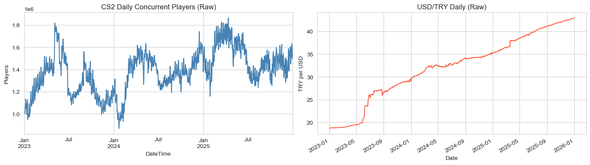

USD/TRY moves almost monotonically upward over the window; BIST100 is
trend-up with two distinct corrections; both gaming series (global CS2,
TR Steam Trends) are visually correlated with USD/TRY's trajectory.

The dual-axis overlay below makes the co-movement between USD/TRY and the
TR Steam-Trends proxy explicit on the original scales (left axis: TRY per
USD, right axis: Trends search interest, 0–100):

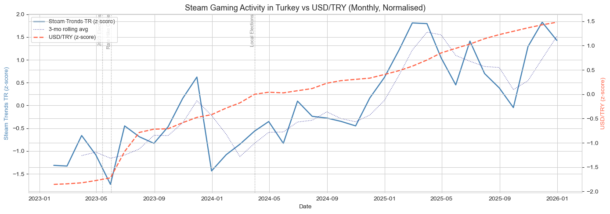

### 4.2 Z-scored view

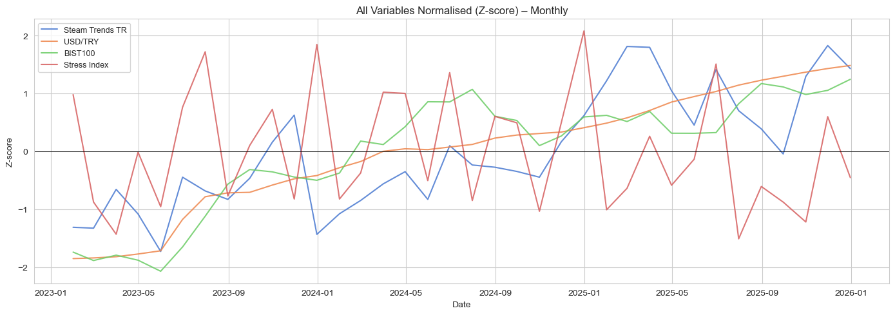

Normalising to z-units lets the five series share an axis. USD/TRY and
the TR Steam-Trends proxy move together; the global CS2 player count is
less synchronised, consistent with it being a worldwide aggregate rather
than a Turkey-specific signal.

### 4.3 Distributions and normality

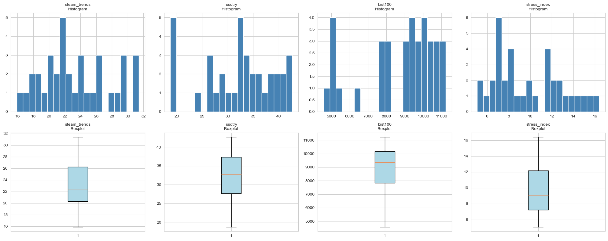
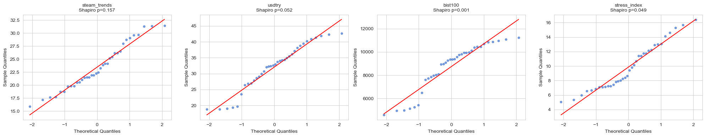

Most variables are mildly non-normal — important justification for using
Mann-Whitney U (rank-based, no normality assumption) for H2 in §5.

### 4.4 Correlation structure

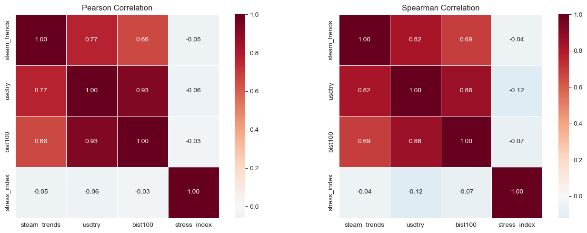

USD/TRY ↔ TR Steam Trends shows the strongest cross-series correlation
in the matrix. BIST100 correlates with USD/TRY (both reflect the same
underlying macro regime). The composite stress index, surprisingly, does
**not** load on the gaming proxy — foreshadowing the H3 result.

### 4.5 Lag structure

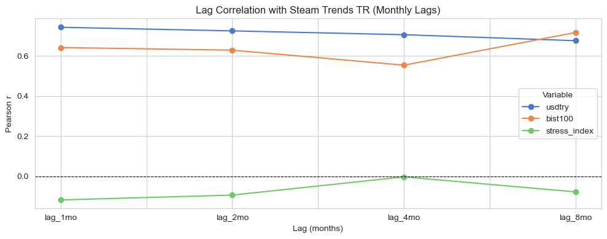

Cross-correlation between `usdtry_z` and `steam_trends_z` peaks at lag 0
and remains positive at lags 1–2. This motivates including 1- and 2-month
USD/TRY lags as ML features (§6).

---

## 5. Hypothesis Tests

Three preregistered hypotheses, tested on the monthly merged dataset.

### H1 — USD/TRY ↔ TR Steam gaming activity (positive correlation)

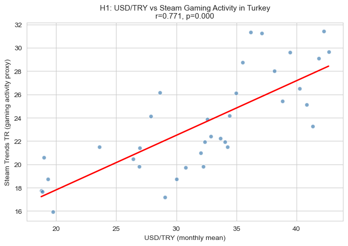

- Test: Pearson correlation, two-sided.
- Result: **r = 0.771, p < 0.001**.
- Conclusion: **Supported.** As USD/TRY rises, Turkey-specific Steam
  search interest rises with a strong, statistically significant linear
  relationship.

### H2 — Crisis vs. normal periods (gaming higher in crisis)

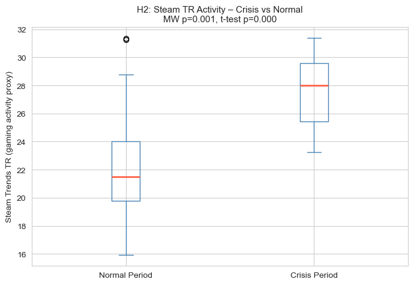

- Definition of crisis month: USD/TRY ≥ 75th percentile of the 36-month
  series (9 crisis months, 27 normal months).
- Test: Mann-Whitney U (two-sided), as run in the EDA notebook.
- Result: **U = 213.0, p = 0.0009**. (One-sided p in the *crisis > normal*
  direction is p = 0.0004; reported value is the two-sided one to match
  the notebook output.)
- Conclusion: **Supported.** TR Steam search interest is significantly
  higher during crisis months than during normal months.

### H3 — Composite stress index ↔ TR Steam gaming activity

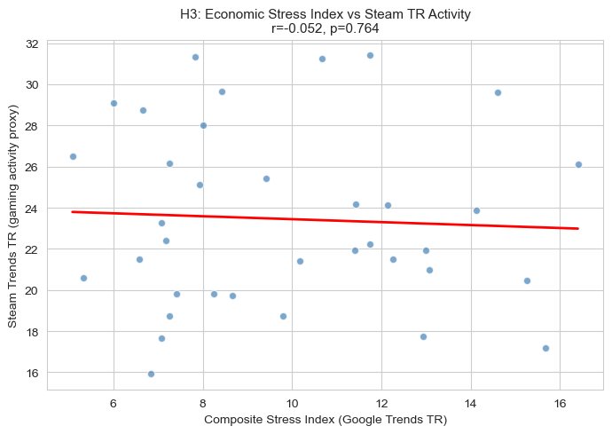

- Test: Pearson correlation, two-sided.
- Result: **r = −0.052, p = 0.764**.
- Conclusion: **Not supported.** The search-volume-based stress index does
  not correlate with the gaming proxy. The likely interpretation: people
  searching for `ekonomik kriz` and people increasing gaming time are
  different sub-populations responding to the same macro shock; the
  market price (USD/TRY) is a cleaner stress signal than search-derived
  sentiment.

### Summary

| Hypothesis | Test | Statistic | p-value | Verdict |
|---|---|---|---|---|
| H1 | Pearson | r = 0.771 | < 0.001 | Supported |
| H2 | Mann-Whitney U (two-sided) | U = 213.0 | 0.0009 | Supported |
| H3 | Pearson | r = −0.052 | 0.764 | Not supported |

---

## 6. Machine Learning Stage

Full notebook: `ML/34314_AliEfeOkudan_ML.ipynb`.
Simpler companion notebook: `ML/ML_Project/ml_implementation.ipynb`.

### 6.1 Setup

- **Target:** `steam_trends_z` (z-scored Google Trends TR for
  steam / cs2 / counter strike).
- **Features (10):** `usdtry_z`, `bist100_z`, `stress_index_z`,
  `steam_players_z`, `usdtry_lag1`, `usdtry_lag2`, `usdtry_roll3`,
  `time_index`, `crisis_period`, `usdtry × crisis` interaction.
- **Train/test:** chronological split — **28-month train**, **6-month
  holdout (2025-07 → 2025-12)**.
- **Validation:** 5-fold `TimeSeriesSplit` on the training set
  (walk-forward). All scaling fit inside an `sklearn.Pipeline` per fold
  to avoid leakage.

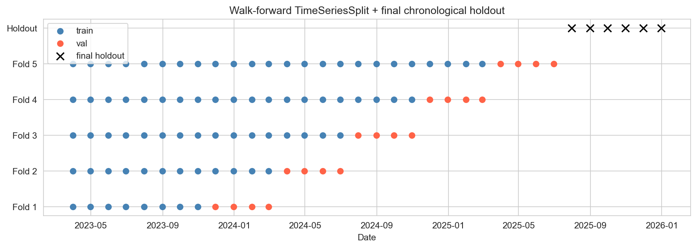

### 6.2 Models compared

- Baselines: mean, naïve persistence (`ŷ_t = y_{t-1}`), univariate OLS on
  `usdtry_z`.
- Learned models: Linear Regression, Ridge, Lasso, ElasticNet (α grid),
  Random Forest, XGBoost (depth grid).

### 6.3 Holdout performance

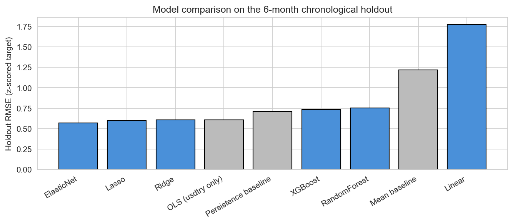

| Model | RMSE (z) | MAE (raw search-volume) | R² |
|---|---:|---:|---:|
| **ElasticNet** | **0.568** | **2.05** | **0.222** |
| Lasso | 0.598 | 2.01 | 0.137 |
| Ridge | 0.608 | 2.07 | 0.108 |
| OLS (usdtry only) | 0.608 | 2.18 | 0.107 |
| Persistence baseline | 0.711 | 2.71 | −0.22 |
| XGBoost | 0.736 | 2.49 | −0.31 |
| Random Forest | 0.754 | 2.62 | −0.37 |
| Mean baseline | 1.220 | 4.51 | −2.59 |
| Linear (no reg.) | 1.775 | 7.44 | −6.61 |

### 6.4 Predictions vs. actual on the holdout

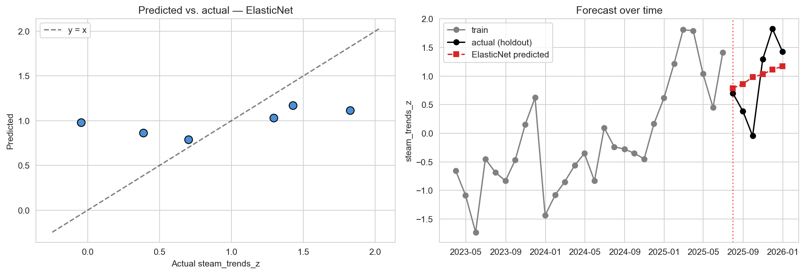
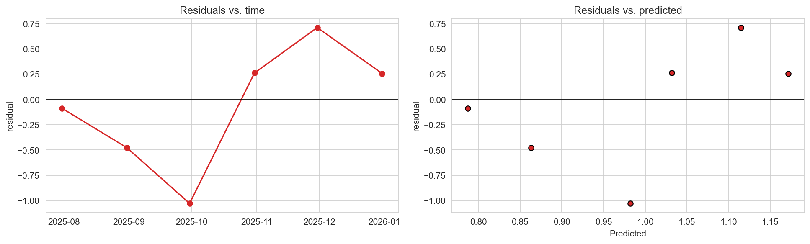

### 6.5 What the model relies on

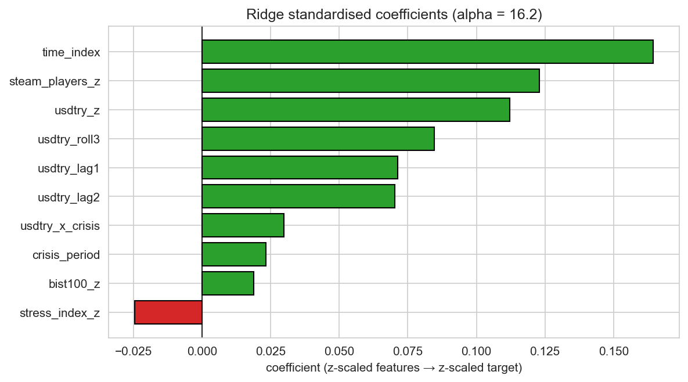
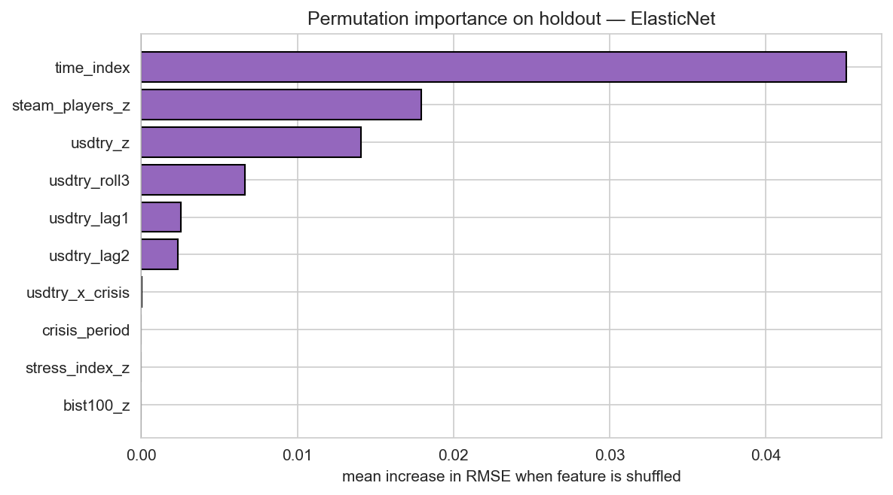
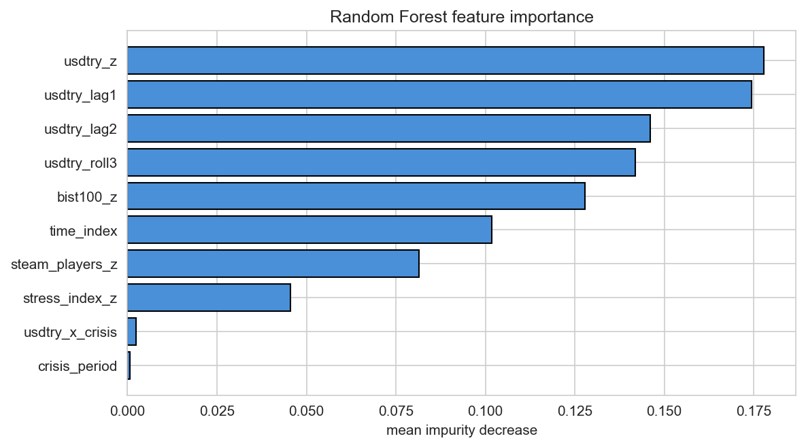

Linear coefficients and permutation importance agree: `usdtry_z` and its
two lags carry essentially all the predictive signal; `stress_index_z`
is near zero (consistent with H3 being unsupported); `crisis_period` is
nearly redundant with the continuous USD/TRY value.

---

## 7. Findings

1. **Macroeconomic depreciation is associated with higher Turkey-specific
   Steam search interest.** Pearson r = 0.771 over 36 monthly observations
   (H1, p < 0.001).
2. **The effect is also observed as a regime shift**, not just a linear
   trend: crisis months (USD/TRY ≥ 75th percentile) show significantly
   higher gaming interest than normal months (H2, Mann-Whitney p < 0.001).
3. **Search-volume-based "stress" is a weaker signal than market price.**
   The composite stress index built from Turkish crisis keywords does
   *not* correlate with the gaming proxy (H3, p = 0.76), and the ML
   stage gives it ≈ 0 permutation importance.
4. **A regularised linear model is the best predictor at this sample size.**
   ElasticNet beats persistence by ~20% on RMSE and is the only
   non-baseline model with positive R² on the chronological holdout.
   Tree models (Random Forest, XGBoost) underperform on n ≈ 28 — a
   textbook small-data result.

Taken together, the EDA and ML stages give **converging support for the
digital-escapism hypothesis** in the Turkish 2023–2025 window, with the
caveat that the effect is detectable through *behaviour proxies*
(Google Trends), not necessarily through people's *expressed* stress.

---

## 8. Limitations

1. **Proxy target.** `steam_trends_z` is a search-interest proxy for actual
   Steam playtime in Turkey. Steam does not publish country-level
   concurrent users, so direct measurement is impossible with public
   data.
2. **Small n.** 36 monthly observations is at the low end for ML; tree
   ensembles in particular cannot be trained reliably.
3. **Single chronological holdout.** A 6-month holdout is one realisation.
   Different windows would give different point estimates.
4. **Pre-split normalisation.** `_z` columns and `crisis_period` were
   computed on the full 2023–2025 window during data processing. This
   keeps the ML stage consistent with the EDA, but a stricter forecasting
   setup should re-fit z-scores and the crisis threshold using only the
   training period.
5. **Limited feature space.** No seasonality, no news shocks, no
   sentiment data, and only short USD/TRY lags. Larger macro models
   (interest rate, CPI, employment) and calendar effects are not included.
6. **Correlation, not causation.** All findings here are observational.
   A causal claim ("currency depreciation *causes* more gaming") would
   require an identification strategy this project does not attempt.
7. **Stress-index keyword pipeline.** `data_collection.py` requests the
   keyword `issizlik` (ASCII spelling), while `data_processing.py` looks
   for the column `işsizlik` (Turkish spelling with `ş`) when building
   the composite stress index. As shipped, the unemployment keyword is
   therefore dropped during aggregation and the stress index is built
   from three of the four planned keywords (`ekonomik kriz`,
   `enflasyon`, `dolar kur`). The reported H3 result already reflects
   this — H3 is *not supported* in either case — but a future revision
   should make the two scripts agree on a single spelling so all four
   keywords are used.

---

## 9. Future Work

- **Daily / weekly granularity** instead of monthly, to better exploit
  the SteamDB and yfinance data and recover lag dynamics.
- **Country-level Steam telemetry** — partnership / API access to Steam
  data would replace the search-interest proxy with a direct measure.
- **Multivariate time-series models** (VAR, state-space, structural
  breaks) suited for joint dynamics of macro + behavioural series.
- **Richer macro features**: TÜFE inflation, central-bank policy rate,
  unemployment claims, consumer confidence index.
- **Turkish-language sentiment data** from news headlines or social
  media to replace the brittle "stress keyword" Trends index used here.
- **Causal-style robustness checks**: placebo windows, leave-one-month-
  out, comparison with a non-crisis country.

---

## 10. Reproducibility

```bash
# 1. Install dependencies
pip install -r requirements.txt

# 2. Collect raw data
python data_collection.py

# 3. Merge, clean, normalise, build the dataset
python data_processing.py

# 4. EDA + hypothesis tests
jupyter notebook 34314_AliEfeOkudan_EDA.ipynb

# 5. ML stage
jupyter notebook ML/34314_AliEfeOkudan_ML.ipynb
```

Notebooks fix `random_state=42` where applicable, so reported numbers are
deterministic.

---

## 11. AI Usage

AI assistance (Claude, Anthropic) was used as a coding-support and
drafting tool. Disclosure:

- **EDA stage** — see the "AI Usage Log" section inside
  `34314_AliEfeOkudan_EDA.ipynb`.
- **ML stage** — see `ML/AI_USAGE.md` for a task-by-task breakdown.
- **Final-report stage** — see `Final/AI_USAGE_FINAL.md` (this report's
  outline and prose were drafted with AI assistance; every claim,
  number, table, and figure was verified against the underlying code and
  data by the author before inclusion).

All research questions, hypotheses, modelling decisions, and conclusions
are the author's. No AI output was kept without verification.

---

## 12. Repository Map (final state)

```
DSA210Proj/
├── data_collection.py
├── data_processing.py
├── main.py                              # small utility / scratch
├── requirements.txt
├── README.md                            # quick-look entry point
├── .gitignore
│
├── 34314_AliEfeOkudan_EDA.ipynb         # EDA + hypothesis tests
├── DSA210Proj.pdf                       # proposal PDF
│
├── merged_dataset.csv                   # monthly, cleaned, z-scored
├── usdtry_2023_2025.csv                 # raw USD/TRY
├── bist100_2023_2025.csv                # raw BIST100
├── google_trends_TR.csv                 # raw Trends (TR)
├── steam_cs2_clean.csv                  # cleaned SteamDB CS2
├── steamdb_chart_730.csv                # raw SteamDB CS2
├── fig_*.png                            # EDA figures
│
├── ML/                                  # milestone 3
│   ├── 34314_AliEfeOkudan_ML.ipynb
│   ├── 34314_AliEfeOkudan_ML.html
│   ├── ml_features.csv
│   ├── fig_ml_*.png
│   ├── AI_USAGE.md
│   └── ML_Project/                      # beginner-style companion notebook
│       ├── ml_implementation.ipynb
│       ├── build_notebook.py
│       ├── REPORT.md
│       ├── results.csv
│       ├── predictions_vs_actual.png
│       └── feature_importance.png
│
└── Final/                               # milestone 4 (this submission)
    ├── FINAL_REPORT.md                  # ← you are here
    ├── AI_USAGE_FINAL.md                # AI disclosure for the final stage
    ├── figures/                         # report-embedded copies of all figures
    │   ├── fig_*.png                    # EDA figures
    │   └── fig_ml_*.png                 # ML figures
    └── data/                            # snapshot of analysis-ready CSVs
        ├── merged_dataset.csv
        └── ml_features.csv
```

The `Final/` folder is **self-contained**: a grader can read the report
and inspect the embedded figures + dataset snapshots without leaving the
folder. The rest of the repository is preserved as-is for traceability of
each earlier milestone.
